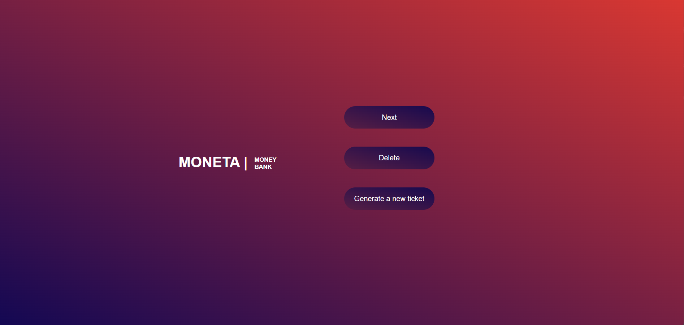
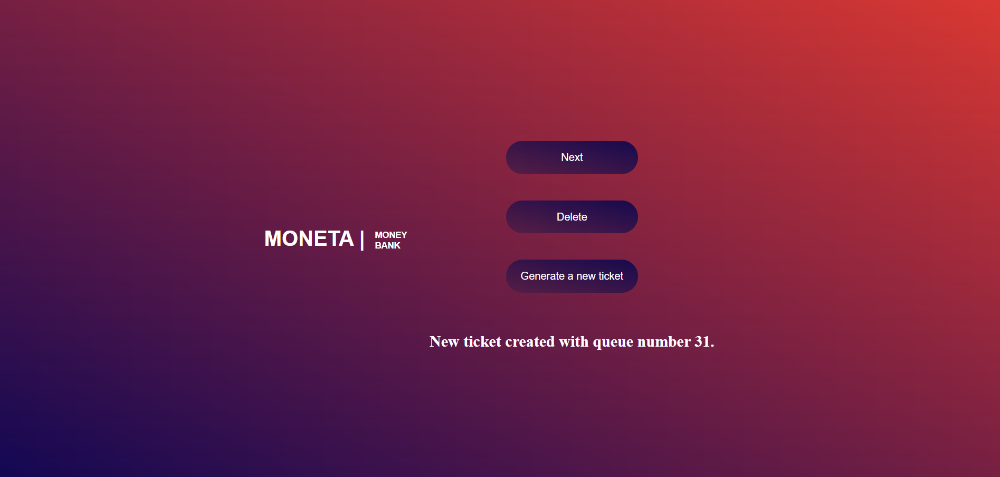
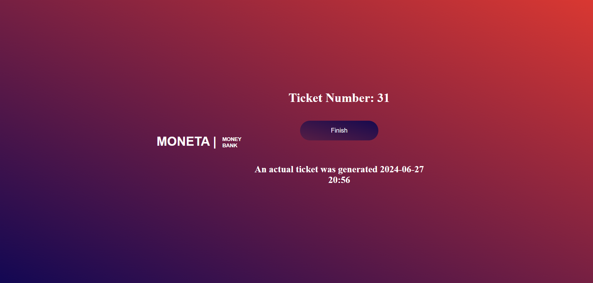
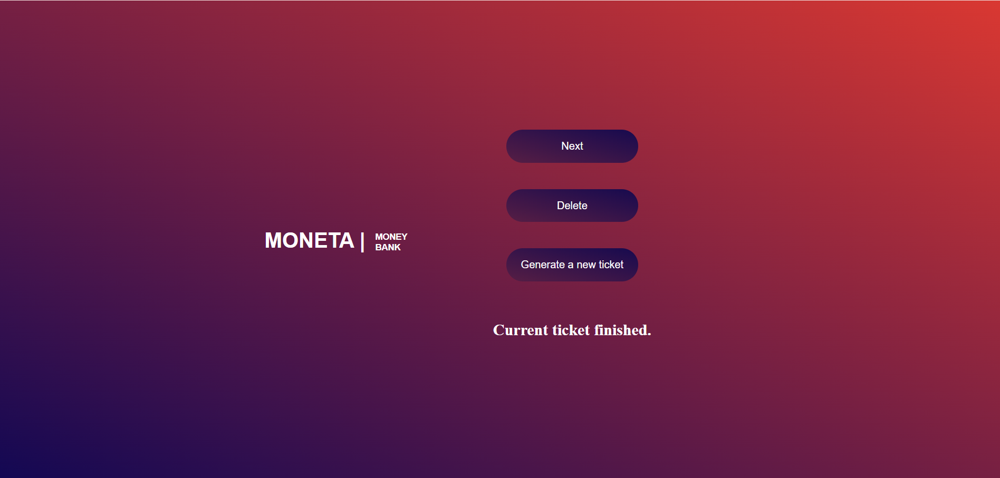

# MONETA Call System
### The MONETA Call System is a web application designed to manage customer service queues for a bank. It allows users to generate new tickets, call the next customer, finish serving the current customer, and delete the last ticket. 

The **backend** is built with:
- **REST API**: The project revolves around a RESTful API for ticket management.
- **Spring Framework**
- **MySQL 8.0**
- **MVC Design Pattern**: Implementing a Model-View-Controller design pattern for a structured and modular codebase.

The **frontend** is implemented using:
- **HTML, CSS**
- **JavaScript** 

This project aims to streamline customer service operations by efficiently managing customer queues in a banking environment.

- *Start page*

- *Click* ***Generate a new ticket***

- *Click* ***Next***

- *Click* ***Finish***

- *Click* ***Delete*** *when no tickets*

